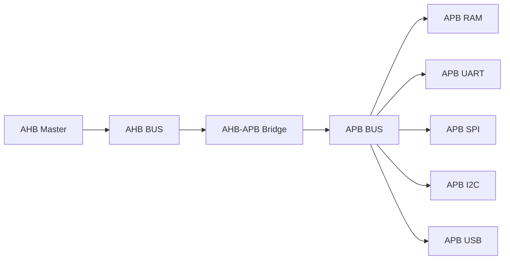
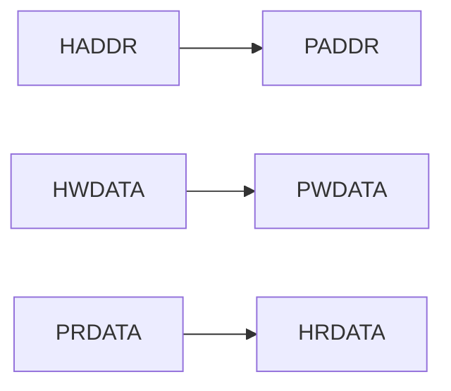
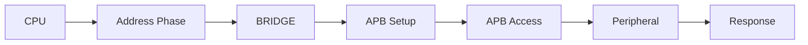
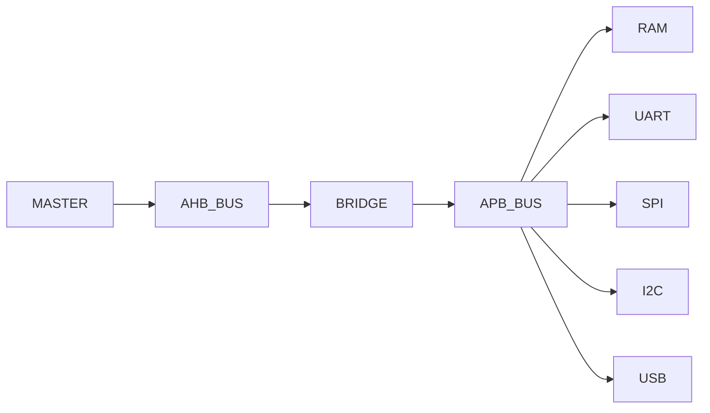
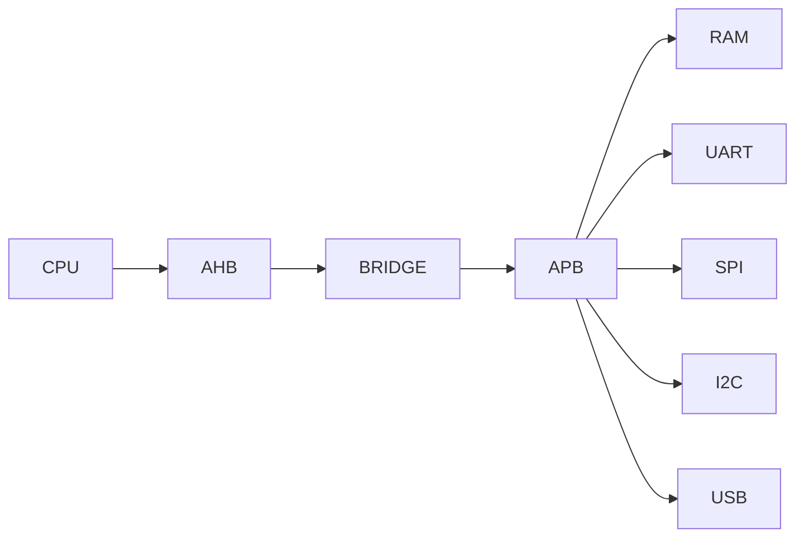

<h1 align="center"> SoC Top Design - AMBA AHB to APB Based System </h1>

---

Top-level integration of AHB, APB, Bridge, and peripherals forming a complete System-on-Chip.

---

# SoC Architecture

- AHB → high-speed backbone  
- APB → peripheral interconnect  
- Bridge → protocol conversion  

---

# Top Module Overview

The `soc_top` module integrates all components:

- AHB Master (transaction generator)  
- AHB Bus (pass-through interconnect)  
- AHB-APB Bridge (protocol conversion)  
- APB Bus (address decoding + mux)  
- APB Peripherals (UART, SPI, I2C, USB, RAM)  

---

# Signal Flow

- Address/control: AHB → APB  
- Write data: Master → Peripheral  
- Read data: Peripheral → Master  

---

# Transaction Flow

- AHB issues address/control  
- Bridge converts to APB SETUP + ENABLE  
- Peripheral executes  
- Response returned back to AHB  

---

# Address Mapping

| Address | Peripheral |
|--------|-----------|
| 0x0000_0000 | RAM |
| 0x0000_1000 | UART |
| 0x0000_2000 | SPI |
| 0x0000_3000 | I2C |
| 0x0000_4000 | USB |

- Decoded using `paddr[15:12]`  
- Generates `psel_*` signals  
- Single active slave per transfer  

---

# Module Connectivity

- `ahb_master` drives bus  
- `ahb_bus` forwards signals  
- `bridge` converts protocol  
- `apb_bus` selects peripheral  
- Wrappers control peripherals  

---

# Key Components

## AHB Master
- Generates write → read sequence  
- Incrementing address pattern  
- Uses NONSEQ transfers  

## AHB Bus
- Simple pass-through  
- No arbitration (single master)  

## AHB-APB Bridge
- Converts AHB → APB  
- Uses FSM: IDLE → SETUP → ENABLE  
- Handles wait states and errors  

## APB Bus
- Address decoder (`paddr[15:12]`)  
- Multiplexes read data  
- Routes ready/error signals  

## Peripherals

### RAM
- Memory-mapped  
- Supports wait states  
- Error on invalid address  

### UART
- TX via `tx_start` pulse  
- RX continuously sampled  

### SPI
- Controlled using `start` bit  
- Configurable CPOL/CPHA  

### I2C
- Start via `enable`  
- Supports read/write  

### USB
- Enabled via control register  
- Minimal wrapper  

---

# System Behavior

- Write phase:
  - AHB → Bridge → APB → Peripheral  
- Read phase:
  - Peripheral → APB → Bridge → AHB  

- Wait states:
  - Introduced by RAM  
  - Propagated via bridge  

- Error:
  - Invalid address → PSLVERR → HRESP  

---

# Design Characteristics

- Single clock domain (clk)  
- Synchronous reset (resetn)  
- Memory-mapped architecture  
- Modular and scalable  

---

# Final System Flow

---

<b>
This SoC integrates AHB and APB protocols through a bridge, enabling structured communication between high-speed core logic and low-speed peripherals in a modular and scalable design.

---
